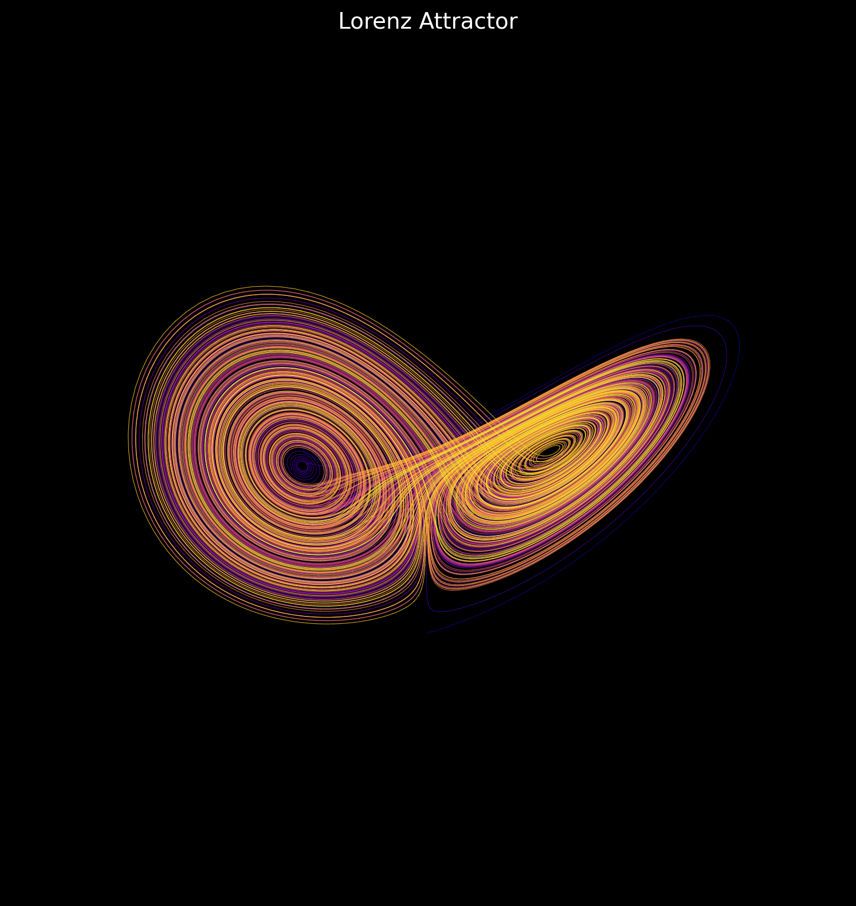
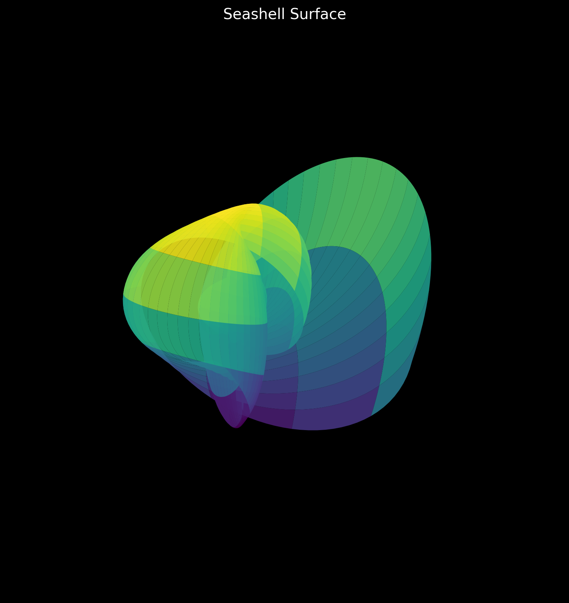
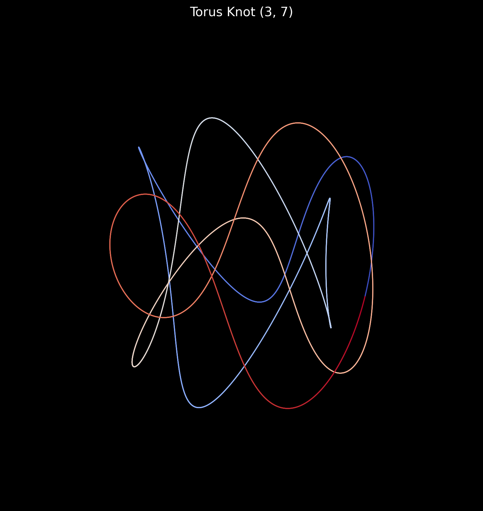
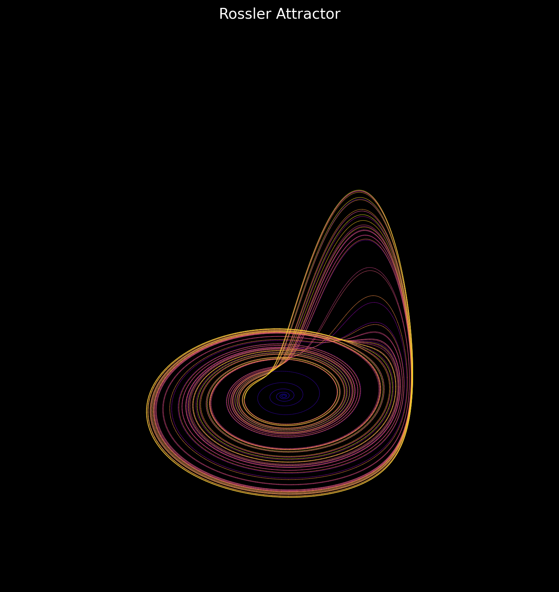

# mathsculpt

> Parametric surfaces and implicit functions as visual objects. Tweak the math, get sculpture.


The idea is simple: mathematics already contains beauty. These scripts expose that — no artistic intent required, just the right function and the right parameters.

---

## Gallery

### Lorenz Attractor
Chaos theory rendered as a 3D trajectory — the butterfly effect made visible.



### Seashell Surface
Logarithmic spiral shell surface — the same mathematics that governs nautilus growth, galaxy arms, and hurricane spirals.



### Torus Knot (3, 7)
A curve that wraps 3 times longitudinally and 7 times meridionally around a torus before closing.



### Rössler Attractor
A simpler chaotic system with a single spiral lobe and a dramatic fold.



---

## Sculptures

| File | Form | Concept |
|------|------|---------|
| `torus_knot.py` | Knotted torus in 3D | Parametric knot curves on a torus surface |
| `seashell.py` | Logarithmic shell surface | Growth spirals via exponential parametrics |
| `strange_attractor.py` | Lorenz / Rössler attractors | Chaos theory rendered as 3D trajectory |
| `minimal_surface.py` | Schwarz P / Gyroid | Surfaces with zero mean curvature |
| `lissajous_3d.py` | 3D Lissajous figures | Frequency ratios as spatial curves |

---

## Quickstart

```bash
git clone https://github.com/hakvinv/mathsculpt.git
cd mathsculpt
pip install numpy matplotlib scipy
python strange_attractor.py
```

Each script is self-contained. Parameters are exposed at the top of the file — change them and see what happens.

---

## Philosophy

These are not visualizations of data. They are objects that exist because the math says they should.

---

*Built by [Hakvin Vosteen](https://github.com/hakvinv)*
